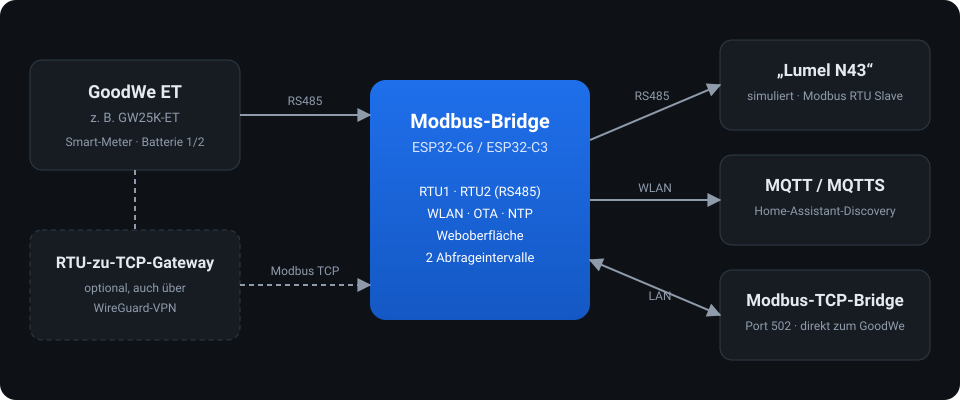
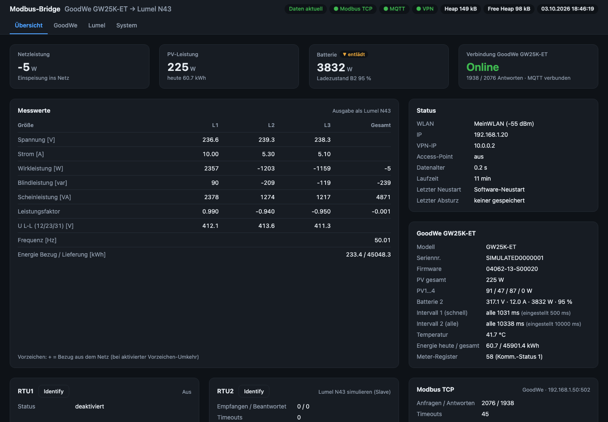
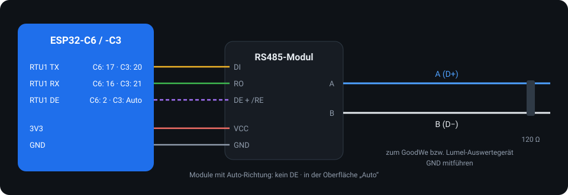
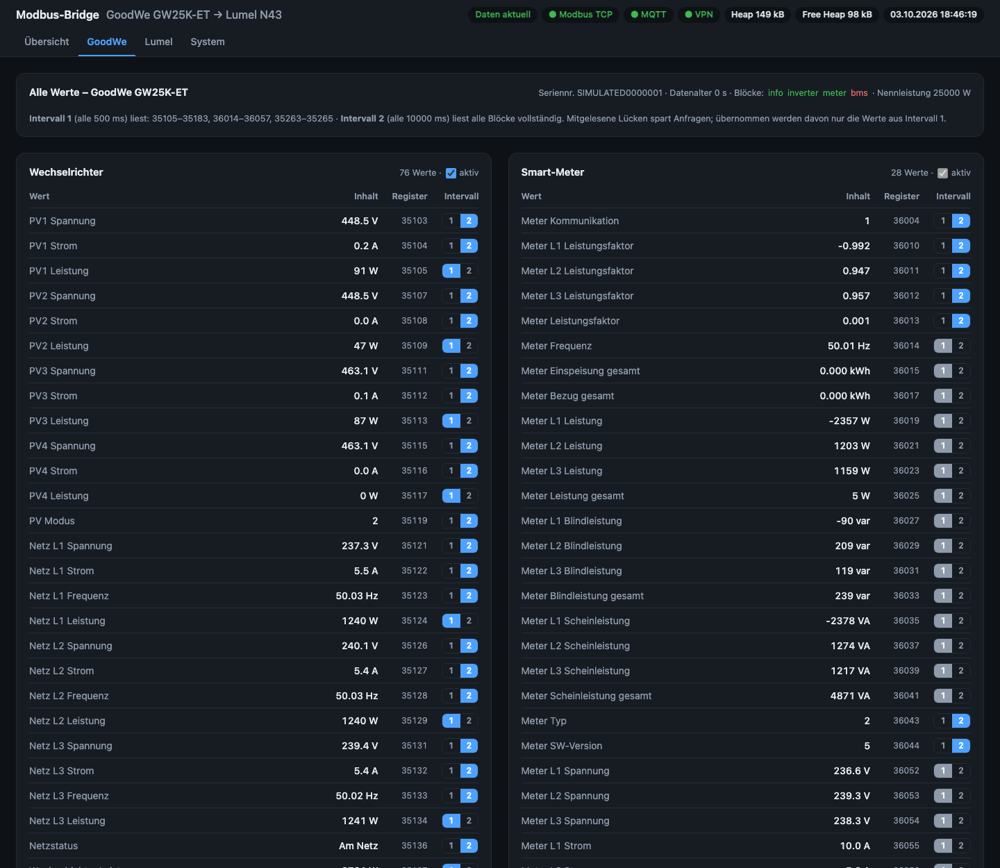
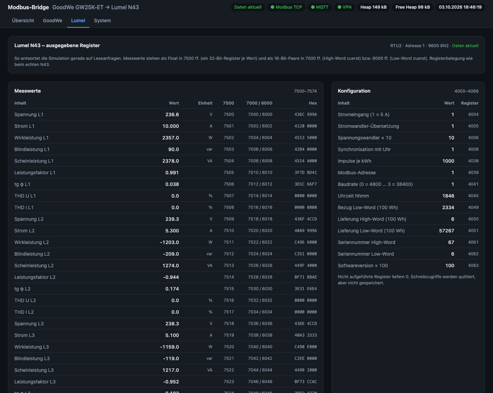
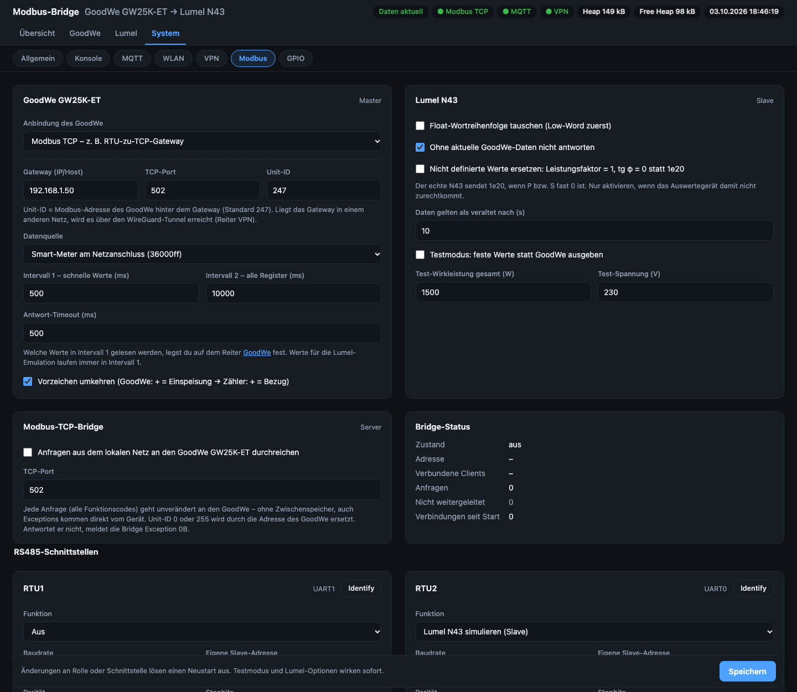
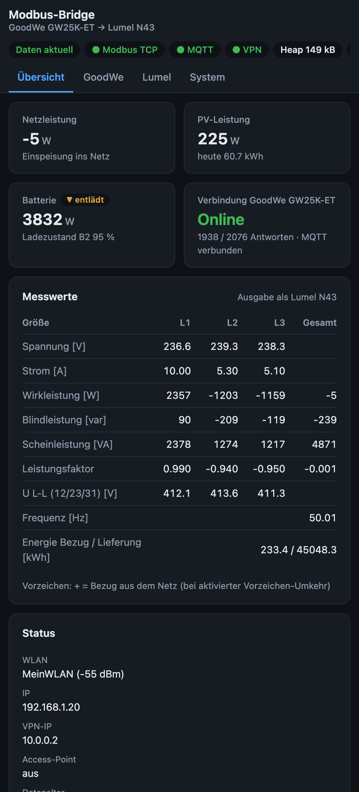

# Modbus-Bridge: GoodWe ET → Lumel N43


Firmware für einen **ESP32-C6** oder **ESP32-C3** mit zwei RS485-Modulen. Sie liest einen
GoodWe-ET-Wechselrichter (z. B. GW25K-ET) aus und gibt dessen Netzwerte als simulierter
**Lumel N43** (3-Phasen-Netzmessgerät) per Modbus RTU aus – ein Modbus-Übersetzer für Geräte,
die einen Lumel-Zähler erwarten. Dazu kommen Weboberfläche, MQTT mit Home-Assistant-Discovery,
OTA mit Rollback, WireGuard-VPN, NTP und eine Modbus-TCP-Bridge.

<p align="center"></p>

<p align="center">
  
</p>

## Funktionen

- **GoodWe auslesen** über RS485 oder Modbus TCP (z. B. RTU-zu-TCP-Gateway, auch über den VPN-Tunnel):
  Geräteinfo, Wechselrichter, Smart-Meter, Batterie 1 und 2 inkl. BMS. Modellname wird ausgelesen
  und überall angezeigt.
- **Zwei Abfrageintervalle:** Intervall 1 (schnell) nur für die Werte, die auf dem Reiter *GoodWe*
  dort einsortiert sind; Intervall 2 liest alle Blöcke vollständig. Benachbarte Register werden zu
  wenigen Anfragen zusammengefasst, übernommen werden aber nur die Werte des jeweiligen Intervalls.
- **Geräte abschaltbar:** Wechselrichter, Smart-Meter, Batterie 1, Batterie 2 – abgeschaltet wird
  nicht abgefragt und nirgends angezeigt.
- **Lumel-N43-Simulation** mit der am echten Gerät geprüften Registerbelegung
  ([docs/lumel_n43_register.md](docs/lumel_n43_register.md)), Reiter *Lumel* zeigt alle ausgegebenen Register.
- **Modbus-TCP-Bridge:** reicht jede Anfrage aus dem lokalen Netz unverändert an den GoodWe durch
  (alle Funktionscodes, ohne Cache, Exceptions original).
- **MQTT / MQTTS** mit Home-Assistant-Auto-Discovery, dazu fertige Anleitung und YAML für das Energie-Dashboard
  und eine Live-Energiefluss-Karte (power-flow-card-plus).
- **OTA-Update** mit Partitionswechsel und automatischem Rollback, **WireGuard-Client**, **NTP**.
- **Web-Konsole** mit Live-Log und Modbus-Busmonitor, **Identify**-Knopf je RS485-Port.

## Build & Flash

Reines **ESP-IDF-Projekt** (ESP-IDF 5.5 über die pioarduino-Plattform für PlatformIO).

| Chip | per USB | per WLAN (OTA) |
|---|---|---|
| ESP32-C6 | `pio run -e esp32-c6 -t upload` | `pio run -e ota -t upload` |
| ESP32-C3 | `pio run -e esp32-c3 -t upload` | `pio run -e ota-c3 -t upload` |

Die Zieladresse für OTA steht in `platformio.ini` (`upload_port`, Standard `modbus-bridge.local`).
Alternativ: `curl --data-binary @firmware.bin -H "Content-Type: application/octet-stream" http://<gerät>/api/update`.

Chip-abhängige Werte (erlaubte GPIOs, Standard-Pins, WLAN-Sendeleistung, Log-Puffer) stehen in
[src/chip.h](src/chip.h); für den C3 gibt es zusätzlich `sdkconfig.defaults.esp32c3` (weniger RAM).

## Erstinbetriebnahme

1. Ohne WLAN-Daten startet der Access-Point **`Modbus-Bridge-XXXX`**, Passwort `modbus1234`.
   Danach `http://192.168.4.1` öffnen (Captive Portal).
2. Unter *System › WLAN* das Heimnetz eintragen. Danach ist das Gerät unter
   `http://modbus-bridge.local` erreichbar.
3. Der Web-Login ist ab Werk aus und lässt sich unter *System › Allgemein* einschalten
   (Standard-Zugang admin / admin – bitte ändern).
4. Werksreset: BOOT-Taste (GPIO 9) beim Einschalten 5 s gedrückt halten.

## Standard-Belegung

| Chip | Port | Funktion | RX | TX | DE/RE |
|---|---|---|---|---|---|
| ESP32-C6 | RTU1 | GoodWe auslesen (9600 8N1, Adr. 247) | 16 | 17 | 2 |
| ESP32-C6 | RTU2 | Lumel N43 simulieren (9600 8N2, Adr. 1) | 20 | 21 | 22 |
| ESP32-C3 | RTU1 | GoodWe auslesen | 21 | 20 | Auto |
| ESP32-C3 | RTU2 | Lumel N43 simulieren | 10 | 3 | Auto |

<p align="center"></p>

Alles ist unter *System › GPIO* bzw. *System › Modbus* änderbar. DE/RE wird von der UART-Hardware
umgeschaltet; für Module mit automatischer Richtungsumschaltung DE auf „Auto“ stellen.
Transceiver mit 3,3-V-Pegel verwenden, Busenden mit 120 Ω terminieren, GND mitführen.

**ESP32-C3 SuperMini:** Die kleine Antenne verträgt keine volle Sendeleistung. Ab ca. 15 dBm bricht
das WLAN zusammen; Standard ist deshalb 11 dBm (einstellbar unter *System › WLAN*, wirkt sofort).

## Weboberfläche

| Reiter | Inhalt |
|---|---|
| Übersicht | Kennzahlen (Netz, PV, Batterie mit Lade-/Entlade-Badge, Verbindung), Messwerte L1–L3, GoodWe-Info, Port-Statistik |
| GoodWe | alle Werte je Gerät, Zuordnung Intervall 1/2 je Wert, Geräte ein/aus, gelesene Registerbereiche |
| Lumel | alle Register, die die Simulation gerade ausgibt (7500 ff., 7000/6000, Hex, Konfiguration 4000 ff.) |
| System › Allgemein | Firmware-Update mit Rollback, NTP und Zeitzone (alle Zeitzonen Europas als Auswahl), Web-Login, Neustart, Werksreset |
| System › Konsole | Live-Log per WebSocket, Befehlszeile, Modbus-Busmonitor |
| System › MQTT | Broker, Topics, Intervall, MQTTS, Home-Assistant-Discovery, Home-Assistant-Dashboard (Energie-Dashboard, Karten-YAML) |
| System › WLAN | Netzsuche, Zugangsdaten, Hostname, AP-Passwort, Sendeleistung |
| System › VPN | WireGuard-Client (Import aus wg-quick-Format, z. B. FRITZ!Box) |
| System › Modbus | GoodWe-Anbindung (RS485/TCP), Datenquelle, Intervalle, Lumel-Optionen, TCP-Bridge, RS485-Ports |
| System › GPIO | Pinzuordnung je RS485-Modul mit Konfliktprüfung |

Die Kopfleiste zeigt Datenstatus, Modbus-, MQTT- und VPN-Verbindung, Heap und die Uhrzeit.

| GoodWe: alle Werte, Intervall 1/2 je Wert | Lumel: ausgegebene Register |
|---|---|
|  |  |
| **System › Modbus: Anbindung, Intervalle, TCP-Bridge** | **Auf dem Smartphone** |
|  |  |

<sub>Screenshots mit Beispieldaten.</sub>

## Register

**GoodWe ET** (FC03, Adresse 247): 35000 ×68 (Geräteinfo, Modell 35060), 35100 ×125 (Wechselrichter),
36000 ×58 bzw. ×45 (Smart-Meter), 37000 ×24 (BMS 1), 35262 ×5 (Batterie 2), 39000 ×22 (BMS 2).
Liefert der Smart-Meter keine Energiezähler (36015/36017 = 0), werden die des Wechselrichters verwendet.
Eine Wallbox am GoodWe wird von ihm nicht durchgereicht.

**Lumel N43**: 7500–7574 (ein float32-Register je Wert), 7000 ff. (2×16 Bit, High-Word zuerst),
6000 ff. (Low-Word zuerst), 4000–4066 Konfiguration und 16-Bit-Energiezähler. Nicht definierte Werte
(PF bzw. tg φ ohne Leistung) werden wie beim echten Gerät als 1e20 gesendet; optional als PF = 1 / tg φ = 0.
Vollständige Tabelle: [docs/lumel_n43_register.md](docs/lumel_n43_register.md).

Vorzeichen: GoodWe zählt Einspeisung positiv. Mit „Vorzeichen umkehren“ (Standard) gilt am Lumel-Ausgang + = Bezug.

## Modbus RTU

Umgesetzt nach *MODBUS over Serial Line V1.02* und *MODBUS Application Protocol V1.1b3*:

- t1,5 / t3,5 über die Hardware-RX-Idle-Erkennung, oberhalb von 19200 Bd feste 750/1750 µs
- Frames mit Pause > t1,5, Paritäts-/Framing-Fehler oder falscher CRC werden verworfen
- Master sendet erst nach ≥ t3,5 Busruhe; Antwort wird auf Adresse, FC, Bytezahl und Länge geprüft
- Slave: FC03, FC04, FC06, FC16, FC08/00; Exceptions 01/02/03; Broadcast (Adr. 0) ohne Antwort

## Einstellungen

Alle Einstellungen liegen als JSON im NVS (eigene Flash-Partition) und überleben OTA-Updates.
Unter *System* lässt sich eine Sicherung herunterladen und wiederherstellen – sie enthält Passwörter
und Zertifikate im Klartext. Passwortfelder lassen sich per Auge-Symbol anzeigen; wer die Oberfläche
erreicht, kann sie also lesen – ggf. den Web-Login aktivieren.

## MQTT & Home Assistant

| Topic | Inhalt |
|---|---|
| `<basis>/status` | `online` / `offline` (retained, Last Will) |
| `<basis>/goodwe/state` | alle GoodWe-Werte als JSON, Schlüssel = MQTT-ID aus dem Reiter *GoodWe* |
| `<basis>/goodwe/<id>` | Einzelwerte (optional) |
| `<basis>/meter/state` | Werte, die als Lumel N43 ausgegeben werden |
| `<basis>/bridge/state` | Diagnose (RSSI, Laufzeit, GoodWe online, Fehlerzähler) |

Zusätzlich sendet die Bridge die Summen **PV Leistung gesamt** und **Batterie Leistung gesamt** für
Energiefluss-Karten. Anleitung: Wiki-Seite
[Energie-Dashboard in Home Assistant](https://github.com/FMDHET/GoodWe-GW25K-ET--to-Lumel_N43-bridge/wiki/Energie-Dashboard-Home-Assistant).

MQTTS (Port 8883) mit Prüfung gegen eigenes CA-Zertifikat, gegen das Zertifikats-Bundle oder ohne
Prüfung; optional Client-Zertifikat (mTLS). Mit Auto-Discovery legt Home Assistant die Geräte
*GoodWe <Modell>* und *Modbus-Bridge* an; Energiezähler sind direkt im Energie-Dashboard nutzbar.

## OTA-Update mit Rollback

1. Image wird in die inaktive Partition geschrieben und geprüft (Chip-Typ, Projektname, zuletzt
   verworfene Version, SHA-256).
2. Bootpartition umschalten → Neustart. Die neue Firmware läuft **auf Bewährung** und wird nach 60 s
   ohne Fehler bestätigt.
3. Startet sie nicht, stürzt sie ab, hängt ein Task (Task-Watchdog, 20 s) oder ist sie nach 5 min nicht
   gesund, startet der Bootloader automatisch wieder die vorherige Firmware.

## USB-/Web-Konsole

```
help | status | config | set <schlüssel> <wert> | port <1|2> <feld> <wert> | wifi <ssid> [pw]
trace on|off | pinscan | detect [baud] [adr] | diag <rx> <tx> <de|-1> | reboot | factory
```

`trace on` protokolliert jeden Modbus-Frame als Hex. `diag` hört den Bus mit und probiert Baudraten,
Formate und gängige Adressen (auch mit vertauschtem RX/TX) durch.

## Testen ohne Wechselrichter

[tools/goodwe_simulator.py](tools/goodwe_simulator.py) simuliert über einen USB-RS485-Adapter einen
GoodWe (Adresse 247, 9600 8N1) mit eindeutigen „Schnapszahlen“ (111,1 V, 2222 W, 33,33 Hz …):

```bash
python3 tools/goodwe_simulator.py --port /dev/cu.usbserial-XXXX   # benötigt pyserial
```

## Dokumentation

| Dokument | Inhalt |
|---|---|
| [docs/architektur.md](docs/architektur.md) | Aufbau, Datenfluss, Tasks, Abfrageintervalle, HTTP-API |
| [docs/goodwe_et_register.md](docs/goodwe_et_register.md) | alle gelesenen GoodWe-Register mit Typ, Teiler und MQTT-ID |
| [docs/lumel_n43_register.md](docs/lumel_n43_register.md) | Registerbelegung des Lumel N43 (am echten Gerät geprüft) |
